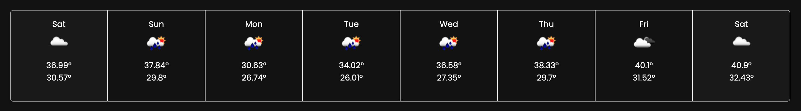
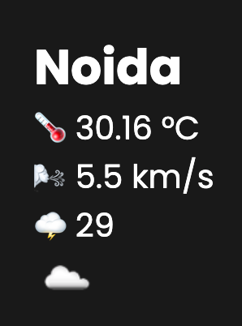

# SkyPulse Weather App

Welcome to SkyPulse, a sleek and responsive weather app that brings you real-time weather and forecast information for any city. This app seamlessly integrates with the OpenWeatherMap API to provide accurate weather data at your fingertips.
 

## Features

- Effortlessly retrieve weather and forecast data using OpenWeatherMap API
- Seamlessly display current weather conditions, forecasts, and city locations
- Instantly fetch weather data for your current city on page load

## Preview

Dive into the world of weather information with this elegant and user-friendly interface:

  

  

## How to Use

1. Clone this repository or download the source code to your local machine.
2. Open the `index.html` file in any modern web browser to launch the app.
3. Upon loading, SkyPulse will automatically fetch and showcase weather details for your current city, determined by your IP address.
4. You can alternatively enter a city name in the input field and click the "Search" button to obtain weather data for that specific city.

## Technologies Employed

SkyPulse combines the power of HTML, CSS, and JavaScript to deliver a seamless weather experience:

- HTML for structure
- CSS for styling
- JavaScript for dynamic functionality

## Behind the Scenes

- The `index.html` file forms the foundation of the app, housing input elements, buttons, and data containers.
- The `style.css` file creatively designs the app with carefully chosen colors, fonts, and a layout that adapts gracefully across various devices.
- The `script.js` file encompasses the core logic of fetching weather and forecast data via the OpenWeatherMap API. It handles user interactions, such as searching for weather data and displaying the user's current location.

## Credits and Resources

- Weather data sourced from [OpenWeatherMap](https://openweathermap.org/)
- IP geolocation provided by [ip-api.com](http://ip-api.com/)
- Icons enriched by [FontAwesome](https://fontawesome.com/)

## Contribution and Exploration

Feel inspired to take part in this project by refining the code, adding innovative features, or resolving any issues. Get ready to embark on a journey of exploring the weather app while gaining insights into the world of web development!

---

Discover more about this project and explore the world of weather data with SkyPulse. This is a part of my portfolio showcasing my journey and skills in web development.
